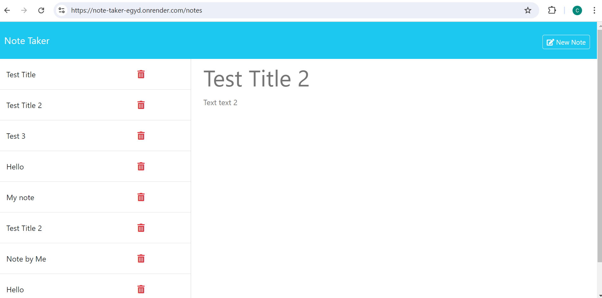

# Note Taker

## Table of Contents
- [Description](#description)
- [Installation](#installation)
- [Usage](#usage)
- [Licenses](#licenses)
- [Contributors](#contributors)
- [Testing](#testing)
- [Contact](#contact-info-for-questions)
- [Application](#deployed-application)
- [Screenshots](#screenshots)

## Description
Note taker is an application used to showcase my skills in node, express, and deploying a full stack application with both front-end and back-end components. 

## Installation
To install this applicaiton, download the code files or clone the git repository and run "npm i" to install the packages. Then run "npm start" to start the local host port.

## Usage
To use this application, you can write a note in the note taking app, click to view past written notes, and clear your note before submitting it. Future development will include the ability to delete notes. 

## Licenses
#### MIT License
The MIT License is an older license used to provide copyright protection.

## Contributors
Christine Matthews (Andreola)

## Testing
N/A

## Contact info for Questions
#### Github: 
<a href="https://github.com/cmatthews3212">cmatthews3212</a>

#### Email: 
<a href="mailto: matthews.christinemarie@gmail.com">matthews.christinemarie@gmail.com</a>

## Deployed Application
https://note-taker-egyd.onrender.com/notes

## Screenshots
